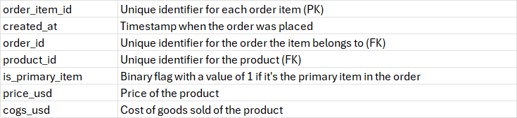
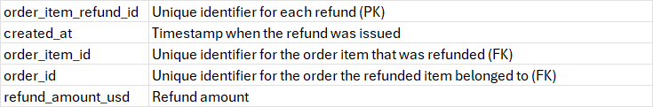
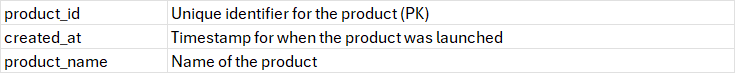

# Toy Store E-Commerce Database Overview  
This database recordes data form online toy store that sells four different products and it contains data within six tables (fact & dimension):  
* orders 
* order_items
* order_item_refunds
* products
* website_sessions  
* website_pageviews
  
## 📅 orders Table (Fact)
Information about each placed order is recorded in eight columns:  

 
  
  
### Grain: One row per order  

### Row Count: **~33K**

## 📅 order_items Table (Fact)
Information about each item in a placed order is contained in seven columns:  

  

### Grain: One row per item per order  
### Row Count: **~40K**  

## 📅 order_item_refunds Table (Fact) 
Information about refunded items is recorded in five columns:  

  

### Grain: One row per refunded item  
### Row Count: **~2K**  

## 📅 products Table (Dimension) 

Information about different products types is contained in three columns:  
  
  

### Grain: One row for each product type  
### Row Count: **4**

## 📅 website_sessions Table (Fact) 

Information about users sessions in the store website is recorded in nine columns:  
  
  

### Grain: One row per session per user
### Row Count: **~500K**  


## 📅 website_pageviews Table (Fact) 
Information about users navigation inside the store website is recorded in four columns:
  
 

### Grain: One row per page viewed per website session
### Row Count: **~1.2M**

## Fact 🆚 Dimension Tables

### 1️⃣ Fact Tables:  
* orders
* order_items
* order_item_refunds
* wedsite_pageviews 
* website session 

These tables mainly contains numeric data about main business events like placing an order, refunding an item and store website visiting.  

### 2️⃣ Dimension Tables:  
* products 
  
These tables contains detailed information and catigorical data about each business event that recorded in fact tables.  

## 🗺️ Tables Relationships Map  
Here is a map that illusterates the relationsships between our tabels.

  

## 🔠 Data Quality Check  
Using MS SQL Server I have checked some major problems that may exists in any data, these are Duplication, Voids and Lost Records. These defects can cause wrong results in analysis process, in turn this may leade wrong business decision. Here what I got.
### Duplication Check
I checked for duplication by typing some simple query. Used ID columns that existed in all tables for this task where the IDs must be unique ones. Applied my simple query on all tables except products table because it contains just four rows for the four products. Here is my query  
```sql
-- Duplication Check
USE ToyStoreEcommrce

-- orders Table
SELECT 
	order_id,
	COUNT(*)
FROM orders
GROUP BY order_id
HAVING COUNT(*) > 1
-- Result: 100% Unique IDs
```

I got the same result for all tables, which means there is no duplication problem in our database.
Here is the full queries file: [Duplication Check Queries.sql](SQL/duplication_check.sql)

### Voids Check
I checked for voids by typing some simple queries. Searched for 'NULL' string and blank spaces in char or varchar data type columns in all tables containes such columns. Here is my query  
```sql
-- Voids Check ('NULL', blank spaces)

/* Note: NULL is not allowed in all columns in tabels in this database
		 So I will search for String 'NULL' or blank spaces in char or varchar data type columns */
		 
-- website_pageviews and website_session tables have nvarchar columns


-- website_pageviews Table
SELECT *
FROM website_pageviews
WHERE pageview_url = 'NULL'
	OR pageview_url = SPACE(LEN(pageview_url))
-- Result: No 'NULL' or blank spaces valuse


-- website_sessions Table
SELECT *
FROM website_sessions
WHERE  utm_source = 'NULL'
	OR utm_source = SPACE(LEN(utm_source))
	OR utm_campaign = 'NULL'
	OR utm_campaign = SPACE(LEN(utm_campaign))
	OR utm_content = 'NULL'
	OR utm_content = SPACE(LEN(utm_content))
	OR device_type = 'NULL'
	OR device_type = SPACE(LEN(device_type))
	OR http_referer = 'NULL'
	OR http_referer = SPACE(LEN(http_referer))
-- Result: 83,328 out of 472,871 rows contains one 'NULL' or balnk space value at leaset
```
Just in website_sessions table I found 83,328 rows contains at least one 'NULL' or blank space value. This is about 17.6% of the table rows, NULL values in UTM fields represent direct or organic traffic rather than data errors.
Here is the queries file: [Voids Check Queries.sql](SQL/voids_check.sql)

### Lost Records Check
I checked for lost records by typing some simple queries. Used FULL JOIN between fact and dimension tables on their related ID columns to make sure that all records in both tables are matched and no lost records exists. Here is a sample of my query  
```sql
-- Lost Records in Fact and Dimension tabels
USE ToyStoreEcommrce

-- orders, order_items and order_item_refunds tables

SELECT 
	oi.order_id,
	o.order_id
FROM orders o
FULL JOIN order_items oi
ON oi.order_id = o.order_id
WHERE 
	o.order_id IS NULL
	OR oi.order_id IS NULL
-- Result: no lost records
```
I got the same result for all fact and dimension tables relationships, which means there is no lost records problem in our database.
Here is the full queries file: [Lost Records Check Queries.sql](SQL/lost_records_check.sql)

Write a short summary:

What tables are most important?

What table drives revenue?

Where returns are stored?

What analysis is possible / not possible?
## ✍️ Summary
The core tables in this database are `orders` and `order_items`, which together drive revenue analysis by capturing order-level and item-level sales data. Product attributes are stored in the `products` table, which serves as the main dimension table.

Product returns are tracked in the `order_item_refunds` table at the item level, allowing detailed return-rate and product quality analysis. Website behavior is captured through `website_sessions` and `website_pageviews`, enabling traffic, funnel, and conversion analysis.

Data quality checks confirmed the absence of duplicate and orphan records across all major table relationships. NULL values found in UTM-related columns of the `website_sessions` table reflect expected direct or organic traffic rather than data defects.

This database supports comprehensive analyses including sales performance, product return behavior, customer conversion funnels, and marketing channel effectiveness.

